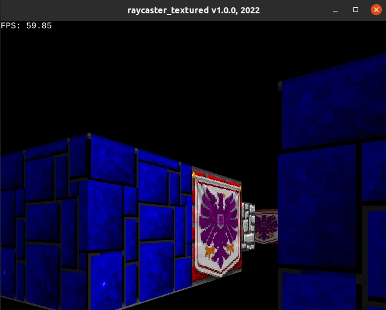

# raycaster_textured v1

## Description

Based the on [Lode's Computer Graphics Tutorial](https://lodev.org/cgtutor/raycasting.html)

Raycasting is a rendering technique to create a 3D perspective in a 2D map. Back when computers were slower it wasn't possible to run real 3D engines in realtime, and raycasting was the first solution. Raycasting can go very fast, because only a calculation has to be done for every vertical line of the screen. The most well known game that used this technique, is of course Wolfenstein 3D.



## Dependencies

* [Good Web Game](https://github.com/ggez/good-web-game)


## Build and run

```
cargo build --release

cargo run --release
```

## Controls

| Key(s)                | Action            |
| --------------------- | ----------------- |
| Up Arrow              | `Move Forward`    |
| Down Arrow            | `Move Backward`   |
| Left Arrow            | `Turn Left`       |
| Right Arrow           | `Turn Right`      |

## Author

* [Antonio Soares](https://github.com/ccie18473)

## License

This project is licensed under the [MIT] License - see the LICENSE.md file for details

The Wolfenstein textures are copyrighted by id Software.
